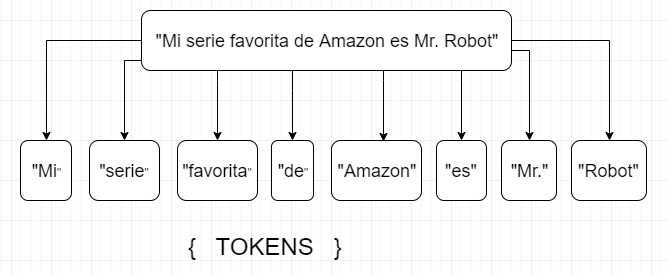

# MANUAL ELASTICSEARCH

## Tabla de contenido.
1. [Elasticsearch](#Elasticsearch)
   1. [Arquitetura Elasticsearch](##Arquitetura-Elasticsearch)
   2. [Despliegue de Elasticsearch](##Despliegue-de-Elasticsearch)
   3. [Busquedas Combinadas](##Busquedas-Combinadas)
   4. [Prueba](##Prueba)
   5. [Prueba](##Prueba)
   
2. [Kibana](#Kibana)
3. [Logstash](#Logstash)
4. [Beats](#Beats)
5. [X-pack](#xpack)
---

# Elasticsearch

* Es una base de datos de busqueda distribuida en formato no relacional.
* Contiene una api que permite su consumo mediante protocolos  http.
* Elasticsearch usa una puntuacion (score) para la relevancia en la busqueda.
* Los principales usos son:
    * Analisis de Logs.
    * Metricas.
    * Analisis de seguridad 
    * Busquedas optimizadas.
--- 

 ## Arquitetura Elasticsearch.

 * Su arquitectura consta de los siguientes componentes:
    * Beats para realizar el envio de informacion a los diferentes servidores.
    * Logstahs como un componente que realiza los procesos ETL.
    * Elasticsearch Como base de datos no relacional, escalable.
    * Kibana Es un componente que permite realizar visualizar los datos y realizar procesos de analitica.
---

## Instalando Elasticsearch

* Para descargar Elasticsearch se puede realizar desde aqui [descarga](https://www.elastic.co/es/start) pagina oficial de Elastic
  
* Estructura y configuracion de archivos.
    * elasticsearch.yml
        + Configurando variable `cluster.name`
        + Configurando variable `node.name`
        + Configurando variable path.data
        + Configurando variable http.port
        + Configurando variable discovery-seed_hosts modo cluster.
        + Configurando variable seguridad con xpack.security.enabled
            + Activando elasticsearch-setup-passwords interactive.

    * jvm.options
        + Xms2G Definiendo memoria RAM
    * Comunicaciones Elasticsearch.
        + Puerto 9200
        + Puerto 9300 
---

## CRUD en Elasticsearch.

* Documentos en Elasticsearch.
    + Indice
        + Que es un Indice
        + Como crear un Indice.  
    + Shard.
    + Replicas.
    + Segmentos.
    + Documentos.
        + ***Que es un Documento :*** es un objeto en formato JSON se almacena en Elasticsearch asignando un unico ID este puede ser asignado por el usuario o autogenerado.
        + Como actualizar un Documento.
            + POST Se usa para actualizar parcialmente los campos 
            + PUT  Se usa para actualizar el documento completo.
        + Como leer un Documento.
        + Como Leer un documento.

* POST
    + ***Metodo bulk :***
        ```bash
        curl -XPOST -u {user}:{pass} localhost:9200/_bulk -H "Content-type: application/json" --data-binary @restaurantes_es.json
        ```

* PUT
* DELETE
* GET
    + GET {index}/_doc/# documento
    + GET {indix}/_search/
---

## Consutas con Elasticsearch

  * _`Match query :`_ Es la consulta basica sobre elasticsearch. Tiene como ventaja las busquedas en campos tipo texto que tienen como fuente (numeros o fechas).

      - Ejemplo sin fiiltros. Por defecto el operator es `"OR"`
      ```JSON
      {
      "query":{
          "match":{
              "DESCRIPCION":"cocina tradicional"
              }
          }
      }
      ```

      - Ejemplo con filtro `"AND"` para minimizar la busqueda
      ```JSON
      {
      "query":{
          "match":{
              "DESCRIPCION":{
                  "query":"cocina tradicional",
                  "operator": "and"
                  }
              }
          }
      }
      ```

      - Ejemplo con filtro `"MINIMUM_SHOULD_MATCH : 2"` para buscar palabras que coincidan con el campo DESCRIPTION debe aparecer como minimo 2 de las palabras mencionadas en el query
      ```JSON
      {
      "query":{
          "match":{
              "DESCRIPCION":{
                  "query":"cocina tradicional",
                  "minimum_should_match": 2
                  }
              }
          }
      }
      ```

      - Ejemplo con filtro `"MATCH_PHRASE"` para buscar la frase completa mencionada en el campo DESCRIPCION
      ```JSON
      {
      "query":{
          "match":{
              "DESCRIPCION":{
                  "query":"cocina tradicional",
                  "minimum_should_match": 2
                  }
              }
          }
      }
      ```

      - Ejemplo con filtro `"SLOP:1"` para indicar cuantas palabras internmedias puede contener entre cocina tradicional {intermedio} mencionada en el campo QUERY
      ```JSON
      {
      "query":{
          "match":{
              "DESCRIPCION":{
                  "query":"cocina tradicional",
                  "minimum_should_match": 2
                  }
              }
          }
      }
      ```

      - Ejemplo de un Resultado
      ```JSON
      {
          "_index": "restaurantes",
          "_type": "doc",
          "_id": "T2QZiHYB4s6UTyM2WD54",
          "_score": 2.9040456,
          "_source": {
              "ID": 91,
              "FECHA_MODIFICACION": "2020-08-08T23:11:17.816Z",
              "NOMBRE": "Bodegón Lagunetas",
              "DESCRIPCION": " El Bodegón Lagunetas está situado en la zona comercial de la Calle Triana. Su especialidad es la cocina tradicional canaria.",
              "DIRECCION": "Constantino 16 35002 Las Palmas de Gran Canaria",
              "WEB": null,
              "TELEFONO": "+34 928363094",
              "PRECIO": "Económico",
              "POIS": "28.1058202, -15.416995300000053",
              "LATITUD": 28.1058202,
              "LONGITUD": -15.4169953,
              "HORARIO": "De lunes a viernes de 07:30 a 23:30 horas. Sábados de 07:30 a 17:00 horas. El primer domingo de cada mes.",
              "ESPECIALIDAD": null,
              "uri": "http://datosabiertos.laspalmasgc.es/api/datos/restaurantes/91.csv"
          }
      }
      ```
---

  * **Range query :** Es un query en formato consulta que se utiliza para busquedas de tipo fecha o numero. 

      - Las consultas de tipo fecha se pueden buscar por String o date math.
      - Date math = Lenguaje user friendly

      - Ejemplo con filtro `"range: {"gte":"valor", "lte":"valor"}"` donde `gte` indica el valor >= y `lte` <= 

          ```JSON
              {
              "query":{
                  "match":{
                      "DESCRIPCION":{
                          "query":"cocina tradicional",
                          "minimum_should_match": 2
                          }
                      }
                  }
              }
          ```

      - Expresiones `"Date Math"`

          | Formato | Valor |
          | -- | -- | -- |
          |y|años|
          |M|meses|
          |w|semanas|
          |d|days|
          |h o H|horas|
          |m|minutos|
          |s|segundos|
---

## Busquedas combinadas.

* Para utilizar busquedas combinadas se usa la funcion `"BOOL QUERY"`, esta funcion cuenta con las siguientes clausulas. `"MUST, SHOULD & FILTER"`.
  
  * `"must :"` Restringe la busqueda dejando como obligatorio el retorno de un valor & `"filter :"` Perminte hacer filtros por diferentes rangos.
    ```JSON
    {
        "query": {
            "bool": {
                "must": [
                    {
                        "match_phrase":{
                            "DESCRIPCION": "cocina tradicional"
                        }
                    }
                ],
                "filter":[
                    {
                        "range": {
                            "FECHA_MODIFICACION":{
                                "gte": "2020-08-01",
                                "lte": "now"
                            }
                        }
                    }
                ]
            }
        }
    }
    ```

  * `"must_not :"` Es lo contrario al must donde se excluyen documentos que no sean necesarios esten en la busqueda.
    ```JSON
    prueba
    ```
      
  * `"should : "` Es la clausula que  cuenta con mas permisos, No excluye documentos.
    ```JSON
        {
        "query": {
            "bool": {
                "must": [
                    {
                        "match":{
                            "HORARIO": "lunes"
                        }
                    }
                ],
                "should":[
                    {
                        "match":{
                            "DESCRIPCION": "canaria"
                        }
                    },
                    {
                        "match":{
                            "DESCRIPCION": "portuguesa"
                        }
                    }
                ], 
                "minimum_should_match": 1
            }
        }
    }
---

## Maping 
* _`Que es Mapping :`_ Es el esquema donde se define la estructura y tipo de datos que contiene el indice. Para un acceso mas optimo es importante la definicion de estos esquemas. Estos son 3 variantes a tener en cuenta para una definición de maping.
  * Nombre de los campos.
  * Tipos de datos de los campos.
  * Como los campos tienen que guardar los datos.

  - Ejemplo: 
    - ```BASH curl -i -H "Accept: application/json" -H "Content-Type: application/json" -X GET http://localhost:9200/restaurantes/_search```

        ```JSON
        {
        "restaurantes": {
                "mappings": {
                    "properties": {
                        "DESCRIPCION": {
                            "type": "text",
                            "fields": {
                                "keyword": {
                                    "type": "keyword",
                                    "ignore_above": 256
                                }
                            }
                        },
                        "DIRECCION": {
                            "type": "text",
                            "fields": {
                                "keyword": {
                                    "type": "keyword",
                                    "ignore_above": 256
                                }
                            }
                        },
                        "ESPECIALIDAD": {
                            "type": "text",
                            "fields": {
                                "keyword": {
                                    "type": "keyword",
                                    "ignore_above": 256
                                }
                            }
                        },
                        "FECHA_MODIFICACION": {
                            "type": "date"
                        },
                        "HORARIO": {
                            "type": "text",
                            "fields": {
                                "keyword": {
                                    "type": "keyword",
                                    "ignore_above": 256
                                }
                            }
                        },
                        "ID": {
                            "type": "long"
                        },
                        "LATITUD": {
                            "type": "float"
                        },
                        "LONGITUD": {
                            "type": "float"
                        },
                        "NOMBRE": {
                            "type": "text",
                            "fields": {
                                "keyword": {
                                    "type": "keyword",
                                    "ignore_above": 256
                                }
                            }
                        },
                        "POIS": {
                            "type": "text",
                            "fields": {
                                "keyword": {
                                    "type": "keyword",
                                    "ignore_above": 256
                                }
                            }
                        },
                        "PRECIO": {
                            "type": "text",
                            "fields": {
                                "keyword": {
                                    "type": "keyword",
                                    "ignore_above": 256
                                }
                            }
                        },
                        "TELEFONO": {
                            "type": "text",
                            "fields": {
                                "keyword": {
                                    "type": "keyword",
                                    "ignore_above": 256
                                }
                            }
                        },
                        "WEB": {
                            "type": "text",
                            "fields": {
                                "keyword": {
                                    "type": "keyword",
                                    "ignore_above": 256
                                }
                            }
                        },
                        "uri": {
                            "type": "text",
                            "fields": {
                                "keyword": {
                                    "type": "keyword",
                                    "ignore_above": 256
                                }
                            }
                        }
                    }
                }
            }
        }
        ```
* _`Modificando un Mapping :`_ Los mapping sol se pueden modificar cuando el cambio es un campo nuevo a ingresar en la estructura del mapping. Para modifcar un campo existente seria necesario eliminar el indice.
---

## Tipos de Datos.

* En Elastic se manejan los siguientes tipos de datos mas comunes.
  
  * _`text :`_ Son campos de tipo texto.
  * _`keywords :`_ Son campos de tipo valor string exactos
  * _`fechas (date) :`_ Son campos de formato tipo fecha
  * _`enteros byte, short, int, log :`_ Son campos de formato tipo numerico
  * _`floats :`_ Son campos de formato tipo numerico con valor flotante
  * _`boolean :`_ Son campos de tipo verdadero o falso
  * _`ip :`_ Son campos de formato para direcciones ip en formato ipv4 o ipv6
---

## Analizadores de texto.

  * Un analizador de texto es la forma en que elasticsearch por debajo interpreta los datos, un ejemplo es cuando aplica un analizar de conversion todo a minuscula para optimizar y obtener un mejor score.
  * Otro dato interesante es que un ananlizador de texto en un campo tipo `keyword` no funcionaria dado el origen de este campo que son valores exactos y difiere `MAYUSCULAS` de `minusculas`. 
  * Los analizadores parten el texto en tokens.
  * los tokens son indexados a un unico documento al ID.

    <p align="center">
    
    </p>

### Probando un analizador de texto.

* Realizando una petición `POST` con `localhost:9200/_analyze`
* En el cuerpo del body se ingresa en la opcion `text` el texto a analizar y en la opcion `analyzer` el tipo de analizador a utilizar.
  
   ```JSON
   {
    "text": "my favorite prove",
    "analyzer" : "stop"
    }
  ```

* Se genera el siguiente resultado en formato JSON.
  ```JSON
    {
        "tokens": [
            {
                "token": "my",
                "start_offset": 0,
                "end_offset": 2,
                "type": "word",
                "position": 0
            },
            {
                "token": "favorite",
                "start_offset": 3,
                "end_offset": 11,
                "type": "word",
                "position": 1
            },
            {
                "token": "prove",
                "start_offset": 12,
                "end_offset": 17,
                "type": "word",
                "position": 2
            }
        ]
    }

  ```

### Personalizando un analizador.

* Se crea el siguiente cuerpo donde la primera parte se crea una lista de tareas con palabras para borrar, en la segunda parte se define el analizador que aplicara al filtro creado.
  
  ```JSON
  {
    "settings":{
            "analysis": {
                "filter": {
                "spanish_stop":{
                        "type":"stop",
                        "stopwords":["en", "mi", "de", "contra", "para", "con"]
                    }
                },
                "analyzer":{
                    "my_analizador": {
                        "type":"custom",
                        "char_filter":[],
                        "tokenizer":"standard",
                        "filter":["lowercase", "spanish_stop"]
                    }   
                }
            }
        }
    }

* Para consultar el analizador creado, se envia una petición `GET` con `localhost:9200/indice` y se obtiene el siguiente resultado.

```JSON
{
    "restaurantes_1": {
        "aliases": {},
        "mappings": {},
        "settings": {
            "index": {
                "routing": {
                    "allocation": {
                        "include": {
                            "_tier_preference": "data_content"
                        }
                    }
                },
                "number_of_shards": "1",
                "provided_name": "restaurantes_1",
                "creation_date": "1608695948781",
                "analysis": {
                    "filter": {
                        "spanish_stop": {
                            "type": "stop",
                            "stopwords": [
                                "en",
                                "mi",
                                "de",
                                "contra",
                                "para",
                                "con"
                            ]
                        }
                    },
                    "analyzer": {
                        "my_analizador": {
                            "filter": [
                                "lowercase",
                                "spanish_stop"
                            ],
                            "char_filter": [],
                            "type": "custom",
                            "tokenizer": "standard"
                        }
                    }
                },
                "number_of_replicas": "1",
                "uuid": "4478yGwjTRijm0WiEjge8A",
                "version": {
                    "created": "7100099"
                }
            }
        }
    }
}
```
* Para el ejemplo anterior se observa que el indice `restaurantes_1` cuenta con analysis, en el campo `stopwords` aparecen las palabras seleccionads y en el campo `my_analizador` los tipos de analizadores seleccionados.
  
* Para probar el analizador, se envia una petición `POST` con `localhost:9200/indice/_analyze` en el cuerpo se pasan los siguientes valores.

```JSON
    {
        "text": "el mensaje en contra de la prueba anterior",
        "analyzer": "my_analizador"
    }
```

* El resultado es el siguiente:

```JSON
    {
        "tokens": [
            {
                "token": "el",
                "start_offset": 0,
                "end_offset": 2,
                "type": "<ALPHANUM>",
                "position": 0
            },
            {
                "token": "mensaje",
                "start_offset": 3,
                "end_offset": 10,
                "type": "<ALPHANUM>",
                "position": 1
            },
            {
                "token": "la",
                "start_offset": 24,
                "end_offset": 26,
                "type": "<ALPHANUM>",
                "position": 5
            },
            {
                "token": "prueba",
                "start_offset": 27,
                "end_offset": 33,
                "type": "<ALPHANUM>",
                "position": 6
            },
            {
                "token": "anterior",
                "start_offset": 34,
                "end_offset": 42,
                "type": "<ALPHANUM>",
                "position": 7
            }
        ]
    }
```

## Que es Kibana

* Kibana es el framework que permite visualizar los datos de elasticsearch en forma amigable, tiene diversas funcionalidades como.
  
  * Crear objetos de los indices, conocido como `Index Pattern`
  * Crear visualizaciones.
  * Crear alertamientos.
  * Generar Dashboards unificando las visualizaciones.
  * Generar comportamientos de Machinelearning.

---
## Desplegando Kibana

* Para descargar kibana se hace desde la url del producto que es la siguiente:
* Configuracion kibana.yml
    + Configurando seguridad con xpack.security.enabled
        + Activando elasticsearch-setup-passwords interactive
---

---

# Recopilando comandos de consulta.

+ Consultar un indice.
  + `GET` localhost:9200/`indice`/_search

+ Consultar el documento de un indice.
  + `GET` localhost:9200/`indice`/_doc/`_id`
  
+ Consultar el maping de indice.
  + `GET` localhost:9200/`indice`/_mapping

+ Eliminar un indice.
  + `DELETE` localhost:9200/`indice`/_mapping

+ Consultar el estado de un cluster..
  + `GET` localhost:9200/`_cluster`/`health?pretty`

+ Consultar estadisticas del cluster (# de shards, almacenamiento, uso de memoria, Informacion de nodos(ccantidad, roles,  os, jvm, memoria, cpu, plugins instalados)).
  + `GET` localhost:9200/`_cluster`/`stats?humman&pretty`

+ Consultar informacion de los Nodos.
  + `GET` localhost:9200/`_nodes`?pretty`

+ Consultar Estadistica de los indies.
  + `GET` localhost:9200/`_stats`?pretty`


---


Fuentes.
* OpenWebinars Curso Elasticsearch y Kibana para desarrolladores.
* OpenWebinars Curso 


Author - Oscar Giovanni Bocanegra
https://www.linkedin.com/in/oscarbocanegra/


https://github.com/OpenWebinarsNet/curso_ElasticSearch
